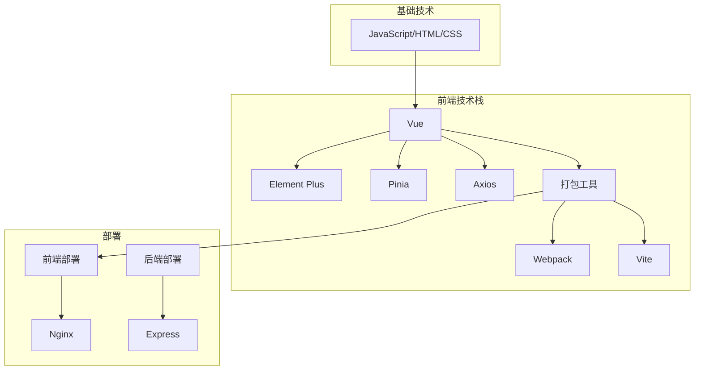
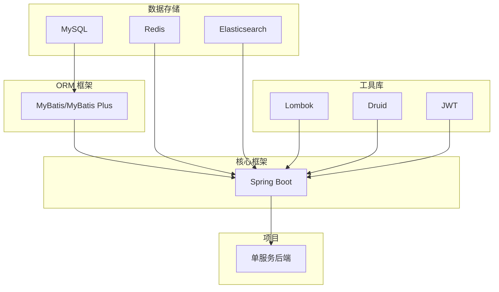

# 泛娱乐与知识社区

## 项目简介

本项目是一个前后端分离的Web工程, 前端基于Vue, 后端基于Spring Boot和Express。随着项目的继续发展, 前端可能上线基于Uniapp开发的小程序版本, 后端可能由基于Spring Boot的单服务版本转向基于Spring Cloud的微服务版本。

本项目的功能模仿常见的中长视频社区, 注重娱乐和知识, 高度参考bilibili、YouTube等。

***详细文档:***
1. [需求文档]()
2. [原型图]()
3. [接口文档]()

***注意点:***
- 敏捷开发
- CI/CD
- 任务管理

## 小组成员和分工
|姓名|学号|分工|
|---|---|---|
|[李雅琪](https://github.com/liyaqi2024)|2220030109|项目部署、管理与测试|
|[卞卡](https://github.com/bkk513)|2212190326|前端开发|
|[李润泽](https://github.com/runze7442)|2220030107|后端开发|

## 项目技术选型

### 前端



### 后端



### 部署

```mermaid
graph TB
    subgraph "云服务"
        A[阿里云 ECS]
    end

    subgraph "操作系统"
        B[Linux]
    end

    subgraph "容器化"
        C[Docker]
    end

    subgraph "Web 服务器"
        D[Nginx]
    end

    subgraph "应用"
        E[应用]
    end

    A --> B
    B --> C
    C --> E
    C --> D
    D --> E
  ```

## 项目计划

```mermaid
gantt
    title 高仿 B 站项目计划
    dateFormat  YYYY-MM-DD
    section 需求分析
    需求分析               :a1, 2023-10-01, 7d
    section 技术选型
    技术选型               :a2, after a1, 7d
    section 前端开发
    前端开发               :a3, after a2, 28d
    section 后端开发
    后端开发               :a4, after a2, 28d
    section 集成测试
    集成测试               :a5, after a3 a4, 14d
    section 部署上线
    部署上线               :a6, after a5, 7d
```

## 项目扩展

如果由更多的实践, 尝试继续开发
1. 上线小程序, 基于uniapp
2. 单服务转向微服务, 基于SpringCloud
