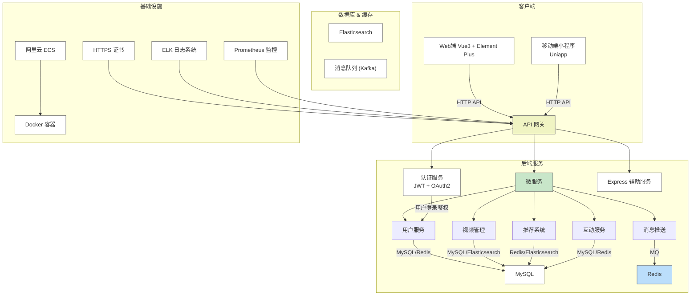
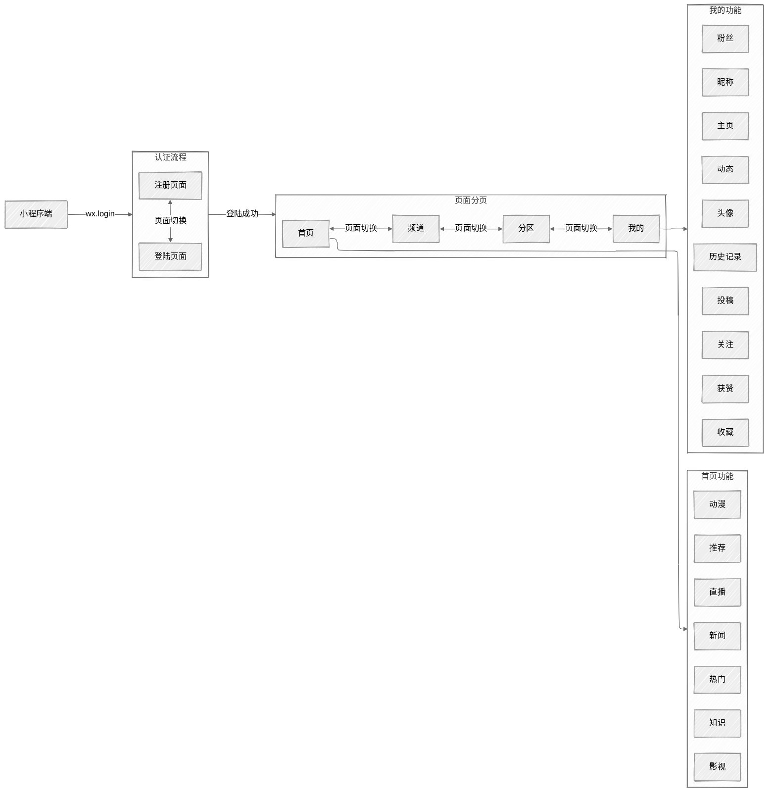

# 系统架构

## 技术栈选择依据：

1. **服务端**：
   - **Eureka**：提供服务发现、负载均衡、熔断、配置管理等功能，支持微服务架构的高效构建。
   - **MySQL**：关系型数据库，适用于存储结构化数据，支撑用户数据和视频管理等业务。
   - **Redis**：关系型数据库，适用于存储结构化数据，支撑用户数据和视频管理等业务。
   - **Elasticsearch**：高效的搜索引擎，提升推荐系统的数据检索和分析能力。
   - **Kafka**：消息队列，适用于视频管理、消息推送等业务的解耦。
   - **Feign**：声明式 Web 服务客户端，简化微服务之间的通信。
2. **Web端**：
   - **Vue3**：现代化框架，具备响应式系统，开发效率高，适合构建动态单页应用。
   - **Element Plus**：企业级 UI 组件库，提供丰富的组件，帮助快速开发具有一致风格的界面。
   - **Vue Router**：强大的路由控制库，支持动态路由配置和嵌套路由功能。
   - **Pinia (状态管理)**：更轻量级、模块化的状态管理工具，适用于 Vue3，提升应用的可维护性。
3. **移动端** (Uniapp)：
   - **Uniapp**：跨平台框架，能够快速适配不同平台。
   - **Vue 语法**：通过 Uniapp 使用 Vue 语法，确保开发者能够在多平台间共享业务逻辑。
   - **Vuex**：状态管理工具，管理小程序的数据流和状态，确保跨平台的一致性。
4. **基础设施**：
   - **阿里云 ECS**：稳定的云服务器，支持弹性伸缩，保证系统的高可用性和扩展性。
   - **Docker 容器**：容器化技术，支持快速构建、部署和扩展微服务架构，提升开发与运维效率。
   - **ELK 日志系统**：集成 Elasticsearch、Logstash 和 Kibana，提供高效的日志采集、存储、分析和可视化功能。
   - **Prometheus 监控**：开源的系统监控和报警工具，适合微服务架构，能实时监控服务的健康状态和性能指标。

##  关键架构设计：

1. **小程序使用流程**：

2. **性能优化措施**

   - **CDN 加速**：静态资源上传OSS，使用CDN加速访问
   - **分页加载**：视频列表分页、懒加载
   - **差分同步**：只传输变更数据，缓存热点数据
   - **数据库优化**：MySQL分库分表、Redis缓存高频数据
