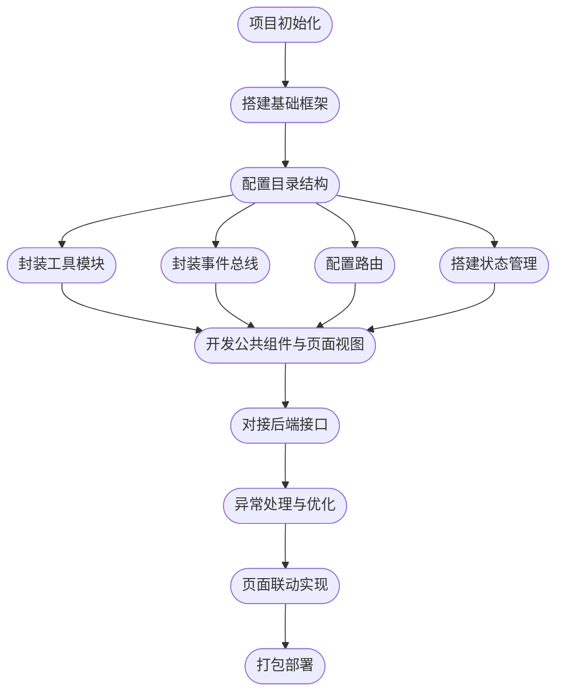

# 前端实现文档

## 1. 技术栈说明

- **基础技术**：HTML5 + CSS3 + JavaScript (ES6+)
- **框架与库**：
  - Vue 3（采用 Composition API，使用 `<script setup>` 语法）
  - Element Plus（UI 组件库）
  - Pinia（状态管理）
  - Axios（网络请求库）
  - Vite（开发与打包工具）

## 2. 项目结构说明

本项目前端采用 **Vue 3 + Vite 技术栈**，整体结构清晰、模块划分合理，目录结构如下：

```plaintext
/src
├── assets                    # 静态资源目录，如图片、样式文件
├── components                # 公共组件目录
│   └── 如NoData.vue            # 无数据提示组件
├── eventbus                  # 事件总线
│   └── eventBus.js              # 使用 mitt 实现全局事件通信
├── router                    # 路由配置
│   └── index.js              # 页面路由导航管理
├── stores                    # 状态管理（Pinia）
├── utils                     # 工具函数
│   ├── Api.js                # API 封装
│   ├── Constants.js          # 常量定义
├── views                     # 页面视图目录
│   ├── Account.vue           # 登录注册页面
│   ├── 404.vue               # 404 页面
│   ├── history.vue           # 历史记录页面
│   ├── Hot.vue               # 24小时热榜页面
│   ├── index.vue             # 首页
│   ├── search.vue            # 搜索页面
│   ├── layout/               # 布局相关组件
│   ├── message/              # 消息页面
│   ├── ucenter/              # 用户中心相关页面
│   ├── userhome/             # 用户主页
│   └── videoDetail/          # 视频详情页
│   └── videolist/            # 视频列表页
├── App.vue                   # 根组件
└── main.js                   # 应用入口文件
```

各模块职责清晰，遵循**高内聚、低耦合**的设计原则。

## 3. 关键实现说明

### 3.1 路由管理

- 使用 `vue-router` 进行路由配置。
- 统一管理页面跳转逻辑，如登录页、首页、历史记录、热榜、视频详情页等。

### 3.2 状态管理

- 使用 `Pinia` 替代传统的 Vuex。
- `/stores` 目录下统一管理应用全局状态，例如用户登录状态、收藏信息等。

### 3.3 网络请求封装

- 使用 `Axios` 进行 HTTP 请求。
- 在 `/utils/Request.js` 中封装统一的请求拦截器与响应拦截器，简化接口调用流程，并统一处理错误提示。

### 3.4 公共组件设计

- `/components/NoData.vue` 示例：
  - 提供统一的「暂无数据」展示。
  - 支持通过 props 动态传入提示信息，提升组件复用性。

### 3.5 跨组件通信

- 使用 `mitt` 轻量化事件通信（`/eventbus/eventBus.js`），在部分页面或组件中传递跨组件事件。

### 3.6 页面开发组织

- 页面视图集中在 `/views` 文件夹，功能模块清晰。
- 子模块（如 layout、userhome、videolist）进一步细分复杂页面结构，提高可维护性。

### 3.7 样式与响应式布局

- 基于 Element Plus 组件，结合自定义 SCSS 样式进行美化和布局。
- 响应式设计，适配多种屏幕尺寸。

## 4. 项目启动与构建

### 4.1 本地启动

```bash
npm install
npm run dev
```

### 4.2 打包发布

```bash
npm run build
```

使用 Vite 作为构建工具，拥有快速热更新和高效打包能力。

# 5. 前端实现流程图



## 6.当前进度

- 已完成主要模块开发
- 正在进行 UI 优化与联调工作