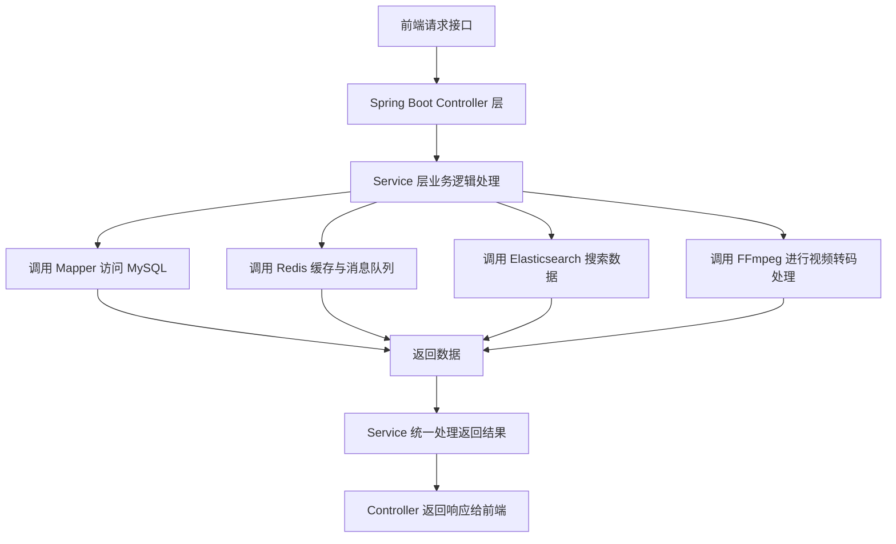

# 后端实现文档

## 1. 技术栈说明

本项目采用了如下后端开发技术栈：

- **核心框架**：
  - **Spring Boot**：主框架，快速构建后端服务。
- **模块化管理**：
  - **Maven 多模块管理**：项目分为 `common`（公共模块）与 `web`（业务模块）。
- **ORM 框架**：
  - **MyBatis / MyBatis-Plus**：简化数据库访问层开发。
- **数据存储与缓存**：
  - **MySQL**：关系型数据库，存储核心数据。
  - **Redis**：既作为缓存加速数据访问，也用于实现轻量级消息队列（发布订阅、延迟任务处理）。
- **搜索引擎**：
  - **Elasticsearch**：用于复杂检索和全文搜索。
- **视频处理**：
  - **FFmpeg**：用于处理视频转码、截图等多媒体处理任务。
- **工具库**：
  - **Lombok**：简化 Java 开发，减少样板代码。
  - **Druid**：高性能数据库连接池，同时支持监控。
  - **JWT (JSON Web Token)**：用户身份验证与授权管理。

## 2. 项目结构说明

项目采用 **Maven 多模块单体服务架构**，主要结构如下：

```plaintext
back
├── java
│   ├── common                    # 公共模块
│   │   └── src
│   │       ├── main
│   │       │   ├── java           # 工具类、通用配置、异常处理
│   │       │   └── resources      # 公共资源文件
│   └── web                        # 业务模块
│       └── src
│           ├── main
│           │   ├── java
│           │   │   └── com.mtp.backend
│           │   │       ├── controller    # 控制层
│           │   │       ├── service       # 服务层接口
│           │   │       ├── service.impl  # 服务层实现
│           │   │       ├── mapper        # 数据访问层
│           │   │       ├── entity        # 实体类
│           │   │       ├── config        # 配置类
│           │   │       ├── utils         # 工具类
│           │   │       └── exception     # 异常处理
│           │   └── resources
│           │       ├── application.yml   # 配置文件
│           │       └── mapper             # Mapper XML 文件
```

说明：

- **common 模块**：提供全局统一封装，比如 JWT 工具、异常定义、公共常量等。
- **web 模块**：实现主要业务逻辑，如接口开放、业务处理、数据库访问、缓存与搜索调用等。
- **各模块独立管理**，统一打包运行。

## 3. 关键实现说明

### 3.1 用户身份认证与授权

- 使用 **JWT** 实现前后端分离认证。
- 登录成功签发 Token，拦截器校验请求 Token 的有效性与权限。

### 3.2 数据缓存与消息队列

- **Redis 缓存**：
  - 缓存热点数据，降低数据库访问压力。
- **Redis 消息队列**：
  - 通过 Redis 发布/订阅机制，实现异步任务处理，例如通知消息推送、延迟任务调度。

### 3.3 搜索功能

- 基于 **Elasticsearch** 实现的全文检索系统。
- 提供关键词模糊搜索、条件过滤等功能。

### 3.4 视频转码

- 集成 **FFmpeg** 工具，后台处理：
  - 视频格式转换
  - 视频截图
  - 提取封面等功能
- 通过调用 FFmpeg 命令行程序或封装的工具类完成转码任务。

### 3.5 数据库操作

- 使用 **MyBatis-Plus** 简化 SQL 操作。
- 支持链式查询、分页查询、批量插入等常用功能。

### 3.6 配置与中间件管理

- 配置项集中管理于 `application.yml`。
- 使用 **Druid** 作为数据库连接池，提供连接监控和性能优化。

## 4. 项目启动与打包

### 4.1 启动步骤

1. 准备环境：
   - 安装 JDK 1.8+
   - 安装 Maven 3.6+
   - 启动 MySQL、Redis、Elasticsearch 服务
2. 修改 `web/src/main/resources/application.yml` 配置数据库、缓存和搜索服务地址。
3. 使用 IDE 运行 `web` 模块下的 `MtpBackendApplication` 启动主程序。

命令行方式：

```bash
cd web
mvn spring-boot:run
```

### 4.2 打包部署

在根目录执行打包命令，自动打包 common 与 web 两个模块：

```bash
mvn clean package
```

生成的 jar 包在 `web/target/` 目录下，部署运行：

```bash
java -jar web/target/xxx.jar
```

## 5. 后端实现流程图



## 6. 当前开发进度

- 已完成登录注册、系统设置功能